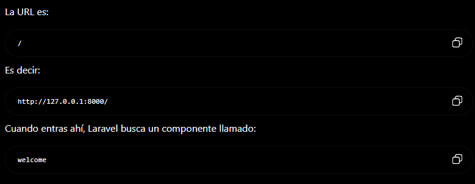
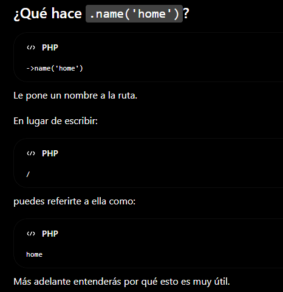

# Laravel + React

Primero instalar [PHP](https://www.php.net/downloads.php) | [Composer](https://getcomposer.org/)

## Instalacion de laravel

En php.ini activar

```shell
;extension=fileinfo
;extension=zip
;extension=pdo_mysql (para mysql)
;extension=mysqli (para mysql)
```

removiendo ";"

### Comandos
Instalacion de laravel

```shell
composer global require laravel/installer
```

Esta instalacion es global para una instalacion local usar

```shell
composer create-project laravel/laravel my-project
```

#### Instalar Proyecto Laravel

una vez tengamos laravel ejecutaremos 

```shell
laravel new mi-proyecto
```

seleccionando react y laravel

# Primera línea importante

```shell
Route::inertia('/', 'welcome')->name('home');
```



### ¿Qué significa?

Route::inertia() crea una ruta que, en lugar de devolver una vista Blade, devuelve un componente de React mediante Inertia.

